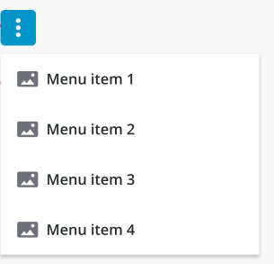

# ptcs-menu-button

## Visual



## Overview

A menu button is a button that opens a menu.

## Usage Examples

### Basic Usage

```html
<ptcs-menu-button items="[[items]]"></ptcs-menu-button>
```

## Component API

### Properties

| Property            | Type    | Description                                                                                                     | Triggers a changed event? |
| ------------------- | ------- | --------------------------------------------------------------------------------------------------------------- | ------------------------- |
| disabled            | Boolean | Disables the button                                                                                             | No                        |
| offset              | Number  | The distance between the button and the menu edge. The default value is 8.                                      | No                        |
| openOnHover         | Boolean | Determines whether hovering the button will trigger the menu. The default value is false.                       | No                        |
| buttonVariant       | Boolean | Set a button variant.                                                                                           | No                        |
| icon                | String  | Sets an icon. The default is "cds:icon_more_vertical".                                                                  | No                        |
| iconSrc             | String  | Sets an icon source.                                                                                            | No                        |
| contentAlign        | String  | Align the label in button to the left, right or center. The default is "center".                                | No                        |
| buttonMaxWidth      | Number  | Set a maximum width for the button widget.                                                                      | No                        |
| label               | String  | The text label in button. The default is "Menu".                                                                | No                        |
| tooltip | String | The tooltip that appears when hovering over the button | No |
| tooltipIcon | String | The icon for the tooltip | No |
| displayIcons        | Boolean | When false, icon data is ignored by the menu, and no icons are rendered. The default is false.                  | No                        |
| allowMissingIcons   | Boolean | When allowMissingIcons is false, and displayIcons is true, a default icon will be assigned to any Menu Item that has no icon data associated with it. The default is false.                                                                                                                    | No                        |
| menuMaxWidth        | String | Sets the maximum width the menu can be reduced to. May be defined by a custom value, in pixels. If set to "auto", the menu will assume the width of its widest menu item. The default is "auto".                                                                                             | No                        |
| menuMinWidth        | String | Sets the minimum width the menu can be reduced to. May be defined by a custom value, in pixels. If set to "auto", the menu will not become narrower than its widest menu item. The default is "auto".                                                                                        | No                        |
| maxMenuItems | String | Defines the maximum number of visible dropdown menu and submenu items. The default is 5. | No |
| iconPlacement       | String | Sets the icon image on the left or right of the text label if any. The default is "left".                                                                                        | No                        |
| menuPlacement | String | Sets the placement of the menu in relation to its button. The property lets you to choose to place the menu on the top/bottom(vertically) or left/right(horizontally) of the button. The exact alignment of the menu will be auto adjusted based on menu button’s position of the page. Options: "vertical" / "horizontal". The default is "vertical". | No |

### Events

| Name | Data | Description |
|------|------|-------------|
| `action` | `ev.detail = { item }` | Generated when the user clicks on a "leaf" in the menu tree (an item without a submenu)|
